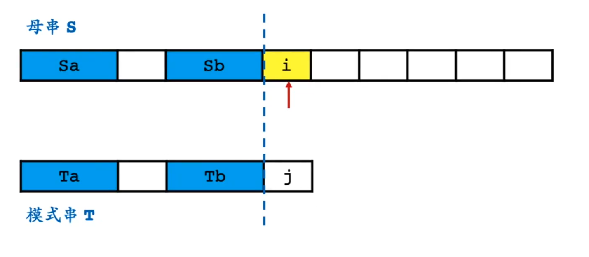
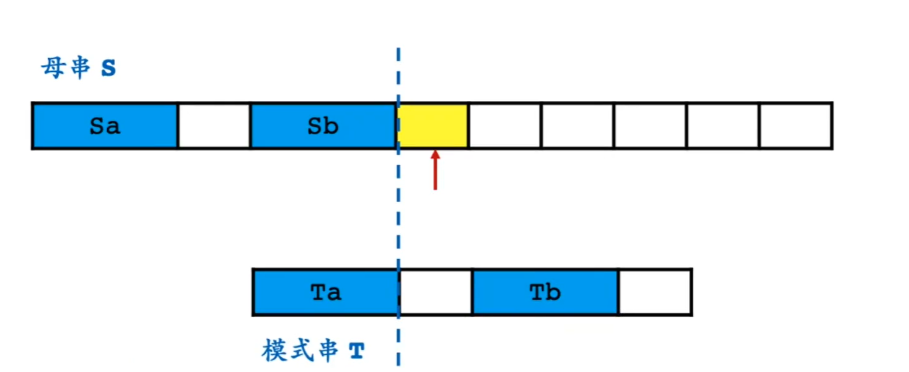

# 字符串匹配

上

[课时 5 : 字符串匹配算法（上）任务学习 - 海贼宝藏 - 专注IT就业与计算机考研在线学习平台 - Powered By EduSoho (haizeix.com)](https://www.haizeix.com/course/616/task/39764/show)

## 朴素匹配算法 Brute-Force

单模匹配

模式串

逐个比较，在母串中找到模式串

```cpp
/*************************************************************************
	> File Name: 1.string_match.c
	> Author: 
	> Mail: 
	> Created Time: Sun Oct  2 21:22:26 2022
 ************************************************************************/

#include <stdio.h>
#include <stdlib.h>
#include <stdbool.h>
#include <string.h>

#define MAX_N 10000
#define DEFAULT_LEN 40
char s[MAX_N + 5], t[MAX_N + 5];

#define TEST(func) { \
	char temp_s[MAX_N + 5]; \
	sprintf(temp_s, "%s(\"%s\", \"%s\") = %3d\n", #func, s, t, func(s, t)); \
	int n = DEFAULT_LEN - strlen(temp_s); \
	while (n--) printf(" "); \
	printf("%s", temp_s); \
}

int brute_force(const char *s, const char *t) {
	// return the first time find string, s is mother string, t is son
	for (int i = 0; s[i] != 0; i++) {
		bool flag = true;
		for (int j = 0; t[j] != 0; j++) {
			if (s[i + j] == t[j]) {
				continue;
			}
			flag = false;
			break;
		}
		if (flag) return i;
	}
	return -1;
}

int test_func(const char *s, const char *t) {
	return -1;
}

int main() {
	while (~scanf("%s%s", s, t)) {
		TEST(brute_force);
		TEST(test_func);
	}
	return 0;
}

```


```shell
youhuangla@Ubuntu string_match % gcc 1.string_match.c                                                                               [0]
youhuangla@Ubuntu string_match % ./a.out                                                                                            [0]
hello ello
     brute_force("hello", "ello") =   1
       test_func("hello", "ello") =  -1
helloworld low
 brute_force("helloworld", "low") =   3
   test_func("helloworld", "low") =  -1
```

## hash匹配法 Rabin-Karp

演示的是大概的算法，原算法自己扩展

滑动窗口
$$
Hash_A = a \times base ^ 3 + e \times base ^ 2 + c \times base ^ 1 + a \times base ^ 0 \\
Hash_B = e \times base ^ 3 + c \times base ^ 2 + a \times base ^ 1 + e \times base ^ 0 \\
\text {2式 = 1式乘base，再加一个减一个}=> Hash_B = Hash_A \times base + e \times base ^ 0 - a \times base ^ 4
$$
最后一个 4 是模式串的长度。

哈希值相等则进行比较；不等则肯定不匹配，不比较。

朴素（暴力）：$O(n \times m)$

哈希：$O(n \times m \div p) \approx O(n)$，p是用于取余的值，哈希冲突的概率是$\frac {1} {p}$。若 $p \approx m$，复杂度约为 $O(n)$。如果想看具体怎么算，找本数据结构书。

p 选个大质数，为什么要设置成质数，大概会出现 p - 1 种余数，涉及数论。base 选奇数？小的质数？ 59:26

### 快速幂算法

如何快速计算 $a ^ {10}$？

10的二进制：1 0 1 0

位权：8 4 2 1

$a^8$  $a^4$ $a^2$  $a^1$

依次遍历二进制中的每一位，如果当前二进制位是1，那么我们就当前位置对应的次方累乘进结果

$a^ {10} = a ^ 8 \times a ^ 2$

```cpp
44:		if (b & 1) { //b&1判断当前二进制(b)末尾是不是1，如果是1则累乘入ans中
```

```cpp
47:			b >>= 1;//b / 2 去掉b二进制表示的最后一位
```

```cpp
/*************************************************************************
	> File Name: 1.string_match.c
	> Author: 
	> Mail: 
	> Created Time: Sun Oct  2 21:22:26 2022
 ************************************************************************/

#include <stdio.h>
#include <stdlib.h>
#include <stdbool.h>
#include <string.h>

#define MAX_N 10000
#define DEFAULT_LEN 40
char s[MAX_N + 5], t[MAX_N + 5];

#define TEST(func) { \
	char temp_s[MAX_N + 5]; \
	sprintf(temp_s, "%s(\"%s\", \"%s\") = %3d\n", #func, s, t, func(s, t)); \
	int n = DEFAULT_LEN - strlen(temp_s); \
	while (n--) printf(" "); \
	printf("%s", temp_s); \
}

int brute_force(const char *s, const char *t) {
	// return the first time find string, s is mother string, t is son
	for (int i = 0; s[i] != 0; i++) {
		bool flag = true;
		for (int j = 0; t[j] != 0; j++) {
			if (s[i + j] == t[j]) {
				continue;
			}
			flag = false;
			break;
		}
		if (flag) return i;
	}
	return -1;
}

int quick_mod(int a, int b, int c) { // 快速幂算法
	int ans = 1, temp = a;
	while (b) {
		if (b & 1) { //b&1判断当前二进制(b)末尾是不是1，如果是1则累乘入ans中
			ans = ans * temp % c;
			temp = temp * temp % c;
			b >>= 1;//b / 2 去掉b二进制表示的最后一位
		}
	}
	return ans;
}

int hash_match(const char *s, const char *t) {
	int len = strlen(t), base = 31, P = 9973, nbase = quick_mod(base, len, P);
	int h = 0;
	for (int i = 0; s[i]; i++) {
		s[i];//1:08:53
	}
}

int test_func(const char *s, const char *t) {
	return -1;
}

int main() {
	while (~scanf("%s%s", s, t)) {
		TEST(brute_force);
		TEST(test_func);
	}
	return 0;
}

```


### hash匹配法与朴素匹配算法比较

```cpp
/*************************************************************************
	> File Name: 1.string_match.c
	> Author: 
	> Mail: 
	> Created Time: Sun Oct  2 21:22:26 2022
 ************************************************************************/

#include <stdio.h>
#include <stdlib.h>
#include <stdbool.h>
#include <string.h>

#define MAX_N 10000
#define DEFAULT_LEN 40
char s[MAX_N + 5], t[MAX_N + 5];

#define TEST(func)                                                              \
	{                                                                           \
		char temp_s[MAX_N + 5];                                                 \
		sprintf(temp_s, "%s(\"%s\", \"%s\") = %3d\n", #func, s, t, func(s, t)); \
		int n = DEFAULT_LEN - strlen(temp_s);                                   \
		while (n--) printf(" ");                                                \
		printf("%s", temp_s);                                                   \
	}

int brute_one_match(const char *s, const char *t) { //匹配一次
	printf("brute_one_match called\n");
	for (int j = 0; t[j]; j++) {
		if (s[j] == t[j]) {
			continue;
		}
		return 0;
	}
	return 1;
}

int brute_force(const char *s, const char *t) {
	// return the first time find string, s is mother string, t is son
	for (int i = 0; s[i] != 0; i++) {
		if (brute_one_match(s + i, t)) {
			return i;
		}
	}
	return -1;
}

int quick_mod(int a, int b, int c) { // 快速幂算法
	int ans = 1, temp = a;
	while (b) {
		if (b & 1) { //b&1判断当前二进制(b)末尾是不是1，如果是1则累乘入ans中
			ans = ans * temp % c;
			temp = temp * temp % c;
			b >>= 1; //b / 2 去掉b二进制表示的最后一位
		}
	}
	return ans;
}

int hash_match(const char *s, const char *t) {
	int len = strlen(t), base = 31, P = 9973, nbase = quick_mod(base, len, P);
	int h = 0, th = 0; // th 模式串哈希值
	for (int i = 0; t[i]; i++) {
		th = (th * base + t[i]) % P;
	}
	for (int i = 0; s[i]; i++) {
		h = (h * base + s[i]) % P;
		if (i >= len) {
			h = (h - (s[i - len] * nbase % P) + P) % P;
		}
		if (i + 1 < len) { //字符串不够文本串长度
			continue;
		}
		if (h != th) { // 模式串哈希值
			continue;
		}
		//h == th 按位比较
		if (brute_one_match(s + i - len + 1, t)) {
			return i - len + 1;
		}
	}
	return -1; //not found
}

int test_func(const char *s, const char *t) {
	return -1;
}

int main() {
	while (~scanf("%s%s", s, t)) {
		TEST(brute_force);
		TEST(test_func);
		TEST(hash_match);
	}
	return 0;
}

```


```shell
youhuangla@Ubuntu string_match % gcc 1_2.string_match.c                                                     [139]
youhuangla@Ubuntu string_match % ./a.out                                                                      [0]
hello ell
brute_one_match called
brute_one_match called
      brute_force("hello", "ell") =   1
        test_func("hello", "ell") =  -1
brute_one_match called
       hash_match("hello", "ell") =   1
```

朴素匹配比哈希匹配算法少调用了一次brute_one_match。哈希匹配算法使用哈希值过滤掉了大量根本不可能的情况。

问题1：两个不同的字符串拥有相同的哈希值，怎么办？

凉拌

问题2：算法的时间复杂度？

$O(n \times m \div p)$ ，p = 2 时大概是朴素匹配算法的一半

```cpp
/*************************************************************************
	> File Name: 1.string_match.c
	> Author: 
	> Mail: 
	> Created Time: Sun Oct  2 21:22:26 2022
 ************************************************************************/

#include <stdio.h>
#include <stdlib.h>
#include <stdbool.h>
#include <string.h>

#define MAX_N 10000
#define DEFAULT_LEN 40
char s[MAX_N + 5], t[MAX_N + 5];

#define TEST(func)                                                              \
	{                                                                           \
		char temp_s[MAX_N + 5];                                                 \
		sprintf(temp_s, "%s(\"%s\", \"%s\") = %3d\n", #func, s, t, func(s, t)); \
		int n = DEFAULT_LEN - strlen(temp_s);                                   \
		while (n--) printf(" ");                                                \
		printf("%s", temp_s);                                                   \
	}

int brute_one_match(const char *s, const char *t) { //匹配一次
	printf("brute_one_match called\n");
	for (int j = 0; t[j]; j++) {
		if (s[j] == t[j]) {
			continue;
		}
		return 0;
	}
	return 1;
}

int brute_force(const char *s, const char *t) {
	// return the first time find string, s is mother string, t is son
	for (int i = 0; s[i] != 0; i++) {
		if (brute_one_match(s + i, t)) {
			return i;
		}
	}
	return -1;
}

int quick_mod(int a, int b, int c) { // 快速幂算法
	int ans = 1, temp = a;
	while (b) {
		if (b & 1) { //b&1判断当前二进制(b)末尾是不是1，如果是1则累乘入ans中
			ans = ans * temp % c;
			temp = temp * temp % c;
			b >>= 1; //b / 2 去掉b二进制表示的最后一位
		}
	}
	return ans;
}

int hash_match(const char *s, const char *t) {
	int len = strlen(t), base = 31, P = 2, nbase = quick_mod(base, len, P);// P change to 2
	int h = 0, th = 0; // th 模式串哈希值
	for (int i = 0; t[i]; i++) {
		th = (th * base + t[i]) % P;
	}
	for (int i = 0; s[i]; i++) {
		h = (h * base + s[i]) % P;
		if (i >= len) {
			h = (h - (s[i - len] * nbase % P) + P) % P;
		}
		if (i + 1 < len) { //字符串不够文本串长度
			continue;
		}
		if (h != th) { // 模式串哈希值
			continue;
		}
		//h == th 按位比较
		if (brute_one_match(s + i - len + 1, t)) {
			return i - len + 1;
		}
	}
	return -1; //not found
}

int test_func(const char *s, const char *t) {
	return -1;
}

int main() {
	while (~scanf("%s%s", s, t)) {
		TEST(brute_force);
		//TEST(test_func);
		TEST(hash_match);
	}
	return 0;
}

```

```shell
youhuangla@Ubuntu string_match % ./a.out                                                                      [0]
helloworld aae
brute_one_match called
brute_one_match called
brute_one_match called
brute_one_match called
brute_one_match called
brute_one_match called
brute_one_match called
brute_one_match called
brute_one_match called
brute_one_match called
 brute_force("helloworld", "aae") =  -1
brute_one_match called
brute_one_match called
brute_one_match called
brute_one_match called
brute_one_match called
  hash_match("helloworld", "aae") =  -1
```

这里one_match 函数调用次数也是暴力匹配一半，但这只是一种巧合。

若将 p 改回 9973 。

```shell
youhuangla@Ubuntu string_match % ./a.out                                                                      [0]
helloworld aae
brute_one_match called
brute_one_match called
brute_one_match called
brute_one_match called
brute_one_match called
brute_one_match called
brute_one_match called
brute_one_match called
brute_one_match called
brute_one_match called
 brute_force("helloworld", "aae") =  -1
  hash_match("helloworld", "aae") =  -1
```

冲突的概率变为 $\frac {1} {9973}$。

## KMP算法

KMP代码复杂度和算法时间复杂度比哈希算法高，但反映的算法思维优秀，有助于理解AC自动机。AVL树也类似。

算法思想：将母串和模式串的匹配过程转换为模式串和自身的匹配，母串很长，但是模式串很短，所以先与自身匹配逻辑上效率更高。


在红色位置之前，前面的元素都相等。


模式串不需要和母串第二位对齐，因为母串的第二位开始`e c a e`和模式串的前四位`a e c a`不想等。`pre_4 != last_4`

模式串不需要和母串第三位对齐，因为母串的第三位开始`c a e`和模式串的前三位`a e c`不想等。`pre_3 != last_3`

模式串可以和母串第四位对齐，因为母串的第四位开始`a e`和模式串的前两位`a e `想等。`pre_2 == last_2`

若匹配到红色`d`位置匹配失败，意味着前面都匹配成功了，现在拿红色的`a`与模式串绿色的`c`匹配。

为什么能这要匹配？红色的`a`与模式串绿色的`c`匹配的配位信息怎么得到的？

有：

>   在红色位置之前，前面的元素都相等。

模式串3、4位与第0、1位相等，可以将红色的`a`与模式串绿色的`c`匹配。

该信息可以只分析模式串得到。

该信息可以用于匹配的过程，可以减少重复的匹配，加快匹配的速度。

KMP算法核心：通过分析模式串，得到关键的匹配信息——在模式串的当前位置为止，可以匹配的最长前缀的信息。


4 对应着前缀 1 。

现将将红色的`a`与模式串绿色的`c`对齐匹配。


红色的`a`与模式串绿色的`c`匹配失败。


现在母串绿色部分无论怎么匹配都匹配不到模式串红色`c`。

将模式串第一位和母串红色位置对齐，继续向后匹配。


### 抽象

`i` 与 `j` 匹配



`i` 与 `j` 匹配失败后，`Sb` 与 `Ta` 匹配，两者后面一个元素分别匹配。文本串指针不变，模式串指针向前跳。



#### 如何通过模式串构造 `Ta` 、`Tb` 的匹配信息？

假设要构造 y 位置之前的最长前缀信息，y 位置之前能匹配上的最长前缀是 Tb ，用 y 和 Ta 的后一位比较，若 `y == z`，匹配到。Ta 、 Tb 中也有一个类似 `Ta 、 Tb`的小结构。递归找大结构中的小结构，直到不存在`Ta 、 Tb`的小结构为止。


文本串指针不变，模式串指针变了

#### KMP算法中存着的到底是什么信息？

在 j 位置上存着 j' 的信息，在 j‘ 位置上存着 j'’ 的信息。


[课时 22 : 经典匹配算法：KMP、Sunday与ShiftAnd 任务学习 - 海贼宝藏 - 专注IT就业与计算机考研在线学习平台 - Powered By EduSoho (haizeix.com)](https://www.haizeix.com/course/575/task/34077/show)

1:44:59
