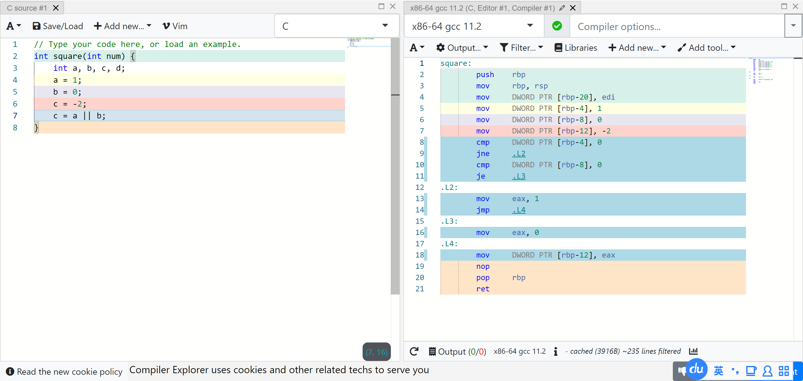
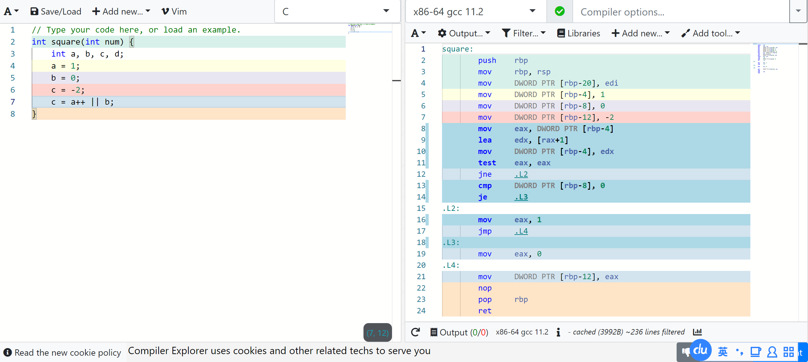
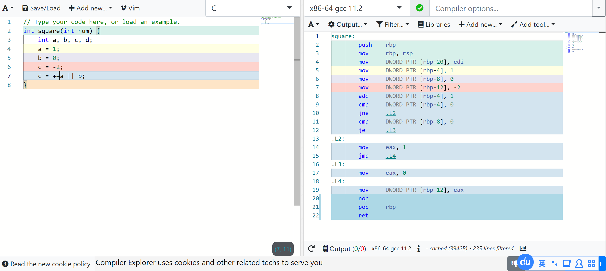
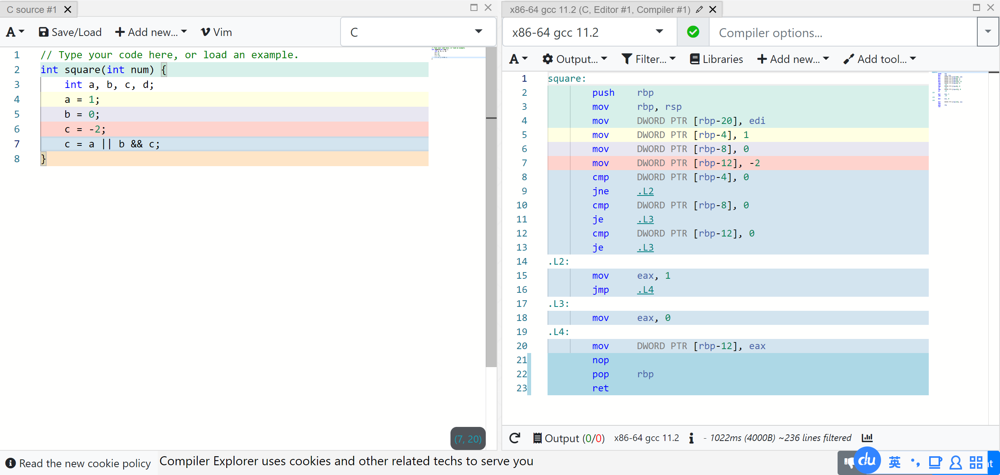
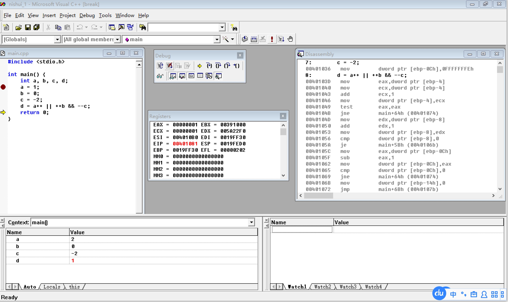

# 7.表达式

## 算数运算符

- 运算符`/ `可能产生意外的结果。当两个操作数都是整数时，运算符/ 会丢掉分数部分来“截取”结果。因此，`1 / 2 `的结果是0而不是0.5。

```c
1.0 / 2 ;//0.5。向高精度转换，2转成2.0，结果是0.5
```


- 运算符`% `要求操作数是整数。如果两个操作数中有一个不是整数，程序将无法编译通过。
- 把零用作`/`或`%`的右操作数会导致未定义的行为（➤4.4节）。
- 当运算符`/`和运算符`%`用于负操作数时，其结果难以确定。
- 根据C89标准，如果两个操作数中有一个为负数，那么除法的结果既可以向上取整也可以向下取整。（例如，`-9 / 7` 的结果既可以是-1 也可以是-2 。）在C89中，如果`i`或者`j`是负数，`i % j`的符号与具体实现有关。（例如，`-9 % 7`的值可能是-2 或者5。） 但是在C99中，除法的结果总是向零截取的（因此-9/7的结果是-1 ），i%j 的值的符号与i 的相同（因此`-9 % 7`的值是-2 ）。

### 运算符的优先级和结合性











​	&&的优先级高于||,但运算符的优先级与系统进行表达式运算的顺序没有必然的关系,比如表达式A||B&&C,由于&&优先级高于||,所以等效于A||(B&&C),但是系统会先对表达式中的A进行判断,若A的值为非零值(真),则由于逻辑运算符的短路效应,后面的表达式B&&C就不再判断;反之则继续进行表达式B&&C的判断

&&可视作*，|| 可视作+

> 逻辑运算符还确保按从左至右的顺序计算操作数。 但是，它们会计算确定表达式结果所需的最小数目的操作数。 这称作“短路”计算。 因此，无法计算表达式的一些操作数。 
>
> [计算的优先级和顺序 | Microsoft Docs](https://docs.microsoft.com/zh-cn//cpp/c-language/precedence-and-order-of-evaluation?view=msvc-170)