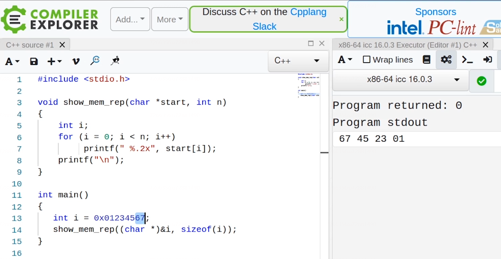
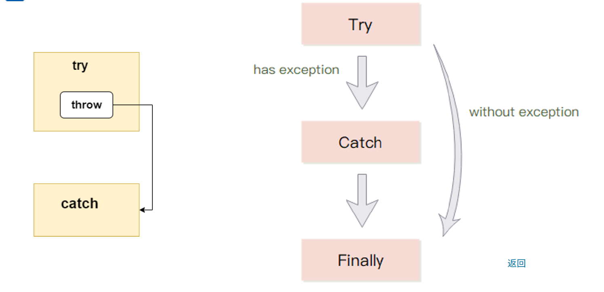

# 00.C++基础

李伟《C++模板元编程》

截图[Lightshot — Mac和Win的截图工具](https://app.prntscr.com/zh-cn/thankyou_desktop.html#install_source=default)

## 目录

1. 什么是C++
2. C++的开发环境与相关工具
3. C++的编译/链接模型

## 什么是C++

- 一门比较流行的编程语言

  https://www.tiobe.com/tiobe-index//

- C 语言的扩展 

  - 关注性能
    - 与底层硬件紧密结合

    - 对象生命周期的精确控制

    - Zero-overhead Abstraction

  - 引入大量特性，便于工程实践
    - 三种编程范式：面向过程、面向对象、泛型

    - 函数重载、异常处理、引用

- 一系列不断衍进的标准集合

  C++98/03 ， C++11 ， C++14 ， C++17 ， C++20 ，C++23 ？

  - 语言本身的改进
    - Memory Model
    - Lambda Expression
  - 标准库的改进
    - type_traits / ranges
    - auto_ptr

- C++标准的工业界实现
  - MSVC / GCC / Clang…
  - 每个编译器可能并不完全遵照标准
    https://godbolt.org/z/cKMjK3
  - 不同的实现存在差异
    https://godbolt.org/z/6hnPhY

- 不能脱离具体的语境讨论C++
- 编写程序时要注重
  - 性能
  - 标准

### 与底层硬件紧密结合

#### 字节序

https://godbolt.org/z/xPq6e9




```cpp
#include <stdio.h> 
  
void show_mem_rep(char *start, int n)  
{ 
    int i; 
    for (i = 0; i < n; i++) 
         printf(" %.2x", start[i]); 
    printf("\n"); 
} 
  
int main() 
{ 
   int i = 0x01234567; 
   show_mem_rep((char *)&i, sizeof(i)); 
} 

```

Java则会规定字节序：大端，更多考虑易用性与兼容性。C与底层硬件精密结合，更关注性能。

### 对象生命周期的精确控制



左：C++，对象生命周期的精确控制，try catch 构造对象，抛出异常后，对象显式销毁

右：C#，抛出异常对象后，对象可能不被销毁，在 Finally 处销毁

### Zero-overhead Abstraction

- 不需要为没有使用的语言特性付出成本

  - 虚函数
    https://godbolt.org/z/fq66hM

    如果类中没有虚函数，则不需要付出成本。C#则没有虚函数，因为类中的所有函数都是虚函数，无论用不用都要付出成本。

  - 堆与栈

    ```cpp
    int fun1()
    {
        int* x = new int(3);//堆上开辟
        return *x;
    }
    
    int fun2()
    {
        int x = 3;//栈上开辟
        return x;
    }
    
    
    ```

    可以看到 fun1 比 fun2 的语句多，fun2 不用堆的成本。C# 的对象则都在堆上构造。


- 使用了一些语言特性不等于付出运行期成本
  https://godbolt.org/z/Pv9bWj

```cpp
consteval auto fun(unsigned input)
{
    unsigned res = 0;
    for (unsigned i = 0; i < input; ++i)
    {
        res += i;
    }
    return res;
}

int main()
{
    return fun(3);//0 + 1 + 2 = 3
}
```


使用了函数，但是没有付出运行期成本，是因为我们付出了编译期成本。

这里用了 C++20 的一个新特性`consteval`，使得该函数只能在编译期执行。由于只需要编译一次，降低了运行期成本。

### 语言本身的改进

增加一些新特性，删除了一些旧特性。

### 标准库的改进

标准库的变化。加入了一些，减少了一些。


deprecated in C++11 在 C++11 中过时，这就是标准库的改进。如果编译warning。

removed in C++17 在17中移除。编译不通过。

### 每个编译器可能并不完全遵照标准

C++2a 即 20


clang 10.0.0不遵从编译器要求。C++20 要求`consteval`函数在编译期执行，该函数由于`int b = 3`，则在运行期执行了。


```cpp
consteval auto fun(int i)
{
    return i + 1;
}

int main()
{
    return fun(3);//改成这样即可
}
```

#### 不同的实现存在差异


以上两个编译器的行为都正确。

这里定义了一个模板的别名，模板的别名和模板原来的名称是否能相等？

该问题在标准中没有规定。

### 不能脱离具体的语境讨论C++

标准与工具。

课上讨论：C++17以及之前，不会讨论遗弃的特性，讨论 20 特性会额外指出。

编译环境：linux，以clang、gcc为主

如果使用win、linux系统库，就会影响可移植性，所以我们只用标准库开发。

## C++ 的开发环境与相关工具

Visual C++ / GCC (G++) / Clang (Clang++)…

集成开发环境：Visual Studio / CodeLite / Code::blocks / Eclipse…

工具

- /usr/bin/time

- valgrind

- [cppreference\.com](https://en.cppreference.com/w/)

-  [Compiler Explorer](https://godbolt.org/)

- [C\+\+ Insights](https://cppinsights.io/)
- Youtube:[CppCon \- YouTube](https://www.youtube.com/user/CppCon)

### Compiler explorer

 [Compiler Explorer](https://godbolt.org/)


这里是因为没有编译选项`--std=c++2a`


Compiler explorer 缺点：只能包含一段代码，无法运行多文件程序。

### C++ insights

[C\+\+ Insights](https://cppinsights.io/)

C++ 标准发展，新标准中C++引入的新语法一定能被老标准中的语法表示。

```cpp
#include <cstdio>

int main()
{
    const char arr[10]{2,4,6,8};

    for(const char& c : arr)
    {
      printf("c=%c\n", c);
    }
}
```

```cpp
#include <cstdio>

int main()
{
  const char arr[10] = {2, 4, 6, 8, '\0', '\0', '\0', '\0', '\0', '\0'};
  {
    char const (&__range1)[10] = arr;
    const char * __begin1 = __range1;
    const char * __end1 = __range1 + 10L;
    for(; __begin1 != __end1; ++__begin1) {
      const char & c = *__begin1;
      printf("c=%c\n", static_cast<int>(c));
    }
    
  }
  return 0;
}

```


