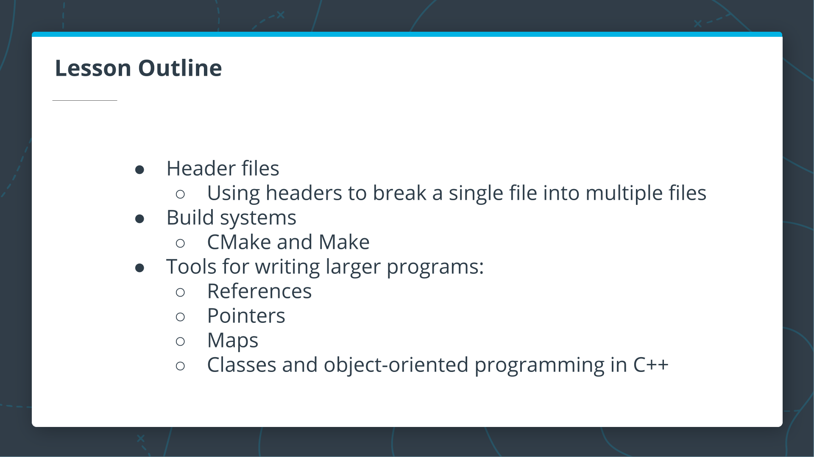

# 07.Writing Multifile Programs.md

## Concept 01: Intro

Welcome to the lesson on writing multi-file programs in C++.

So far in this course,you've written all of your code in a single file.This works well for small programs or while you're prototyping an idea.But as your code-base grows,you'll want the ability to organize your code into multiple files,just as you might have done in other languages you've worked with.

In this lesson you'll learn how to do exactly that.We'll start out with header files and you'll use header files to break a single file into multiple files. Then you'll learn a little bit about build systems which will allow you to efficiently build large programs, and a particular build system we'll cover is CMake and Make.

Then you'll learn some tools for writing larger programs including references,pointers, maps, classes and a little bit of object-oriented programming in C++.You will learn a lot more about object-oriented programming in a later course in this nano degree.But after this lesson,you'll be ready to tackle the route planning project and you'll be prepared to write your own multi-file programs.

## Concept 02: Header Files

Header files, or `.h` files, allow related f<u>unction, method, and class declarations</u> to be collected in one place. The corresponding definitions can then be placed in `.cpp` files. The compiler considers a header declaration a "promise" that the definition will be found later in the code, so if the compiler reaches a function that hasn't been defined yet, it can continue on compiling until the definition is found. This allows functions to be defined (and declared) in arbitrary order.

## Concept 03: Using Headers with Multiple Files

## Concept 04: Bjarne on Build Systems

## Concept 05: CMake and Make

## Concept 06: References

## Concept 07: Pointers

## Concept 08: Pointers Continued

## Concept 09: Bjarne on pointers

## Concept 10: References vs Pointers

## Concept 11: Bjarne on References

## Concept 12: Maps

## Concept 13: Classes and Object-Oriented Programming

## Concept 14: Classes and OOP Continued

## Concept 15: This Pointer

## Concept 16: How Long Does it Take to Learn C++?

## Concept 17: Outro