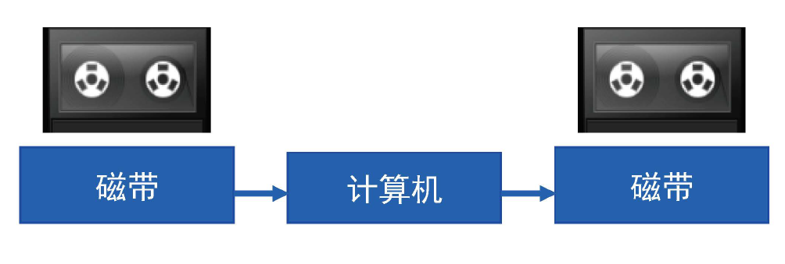
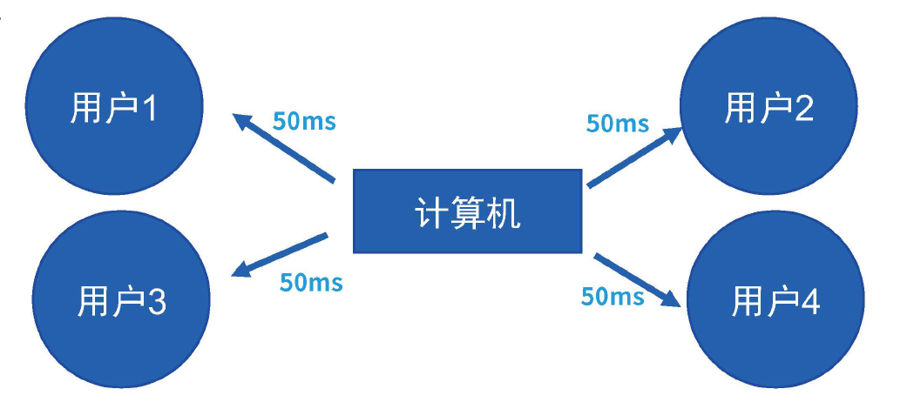

# 1


## 课程介绍

### 理解操作系统的基本概念

通过系统学习Linux操作系统，明确操作系统的定义，功能，特征，重点是操作系统提供的服务

### 重点知识重点学习

文件、进程、线程、锁等考研重点考点将作为本课程的重点内容学习

### 课程主线贴近408操作系统

以理论学习为主，代码实战为辅，学习操作系统知识，通过实战加强对操作系统的认识

### 实战以C语言为主

本阶段课程主要使用C语言作为编程语言，请保证已经完成C语言相关课程的学习

### 考研重难点知识实战

对文件，进程，线程等部分内容，采用实战训练的方式加强理解

### 随堂代码共享

在代码实战中的随堂代码，将在github上为大家同步更，

## 学习本课程的关键

1.   下定决心，坚持练习
2.   巧用系统手册与搜索引擎
3.   活学活用，理论结合实践

操作系统的学习主要在于明确操作系统提供给我们的服务与功能，并将它们用起来

## 操作系统的概念／定义

### 计算机系统层次结构


硬件：包括CPU、内存、硬盘、主板等

### 概念

操作系统(Operating System, OS) 是指控制和管理整个计算机系统的硬件和软件资源<a href="#op_1">①</a>，并合理地组织调度计算机的工作和资源的分配<a href="#op_3">③</a>；以提供给用户和其他软件方便的接口和环境<a href="#op_2">②</a>；它是计算机系统中最基本的系统软件。

<a id="op_1">①</a>系统资源的管理者

<a id="op_2">②</a>向上提供方便医用的服务

<a id="op_3">③</a>是最接近硬件的一层软件


## 操作系统的目标和功能

### 作为系统资源的管理者

我们把用户比作雇主，操作系统比作工人（用来操作机器），计算机是机器（处理机＋存储器＋设备＋文件
等）。

工人控制和协调各个部件的工作 <=> 操作系统对资源（硬件＋软件）的管理。


### 向上层提供方便简易的服务

我们把用户比作雇主，操作系统比作工人（用来操作机器），计算机是机器（处理机＋存储器＋设备＋文件等）。

工人通过包装为雇主提供服务 <<=> 操作系统为用户提供接口

**“封装”**思想：操作系统把一些丑陋的硬件功能封装成简单易用的服务，使用户能更方便地使用计算机，用户无需关心底层硬件的原理，只需要对操作系统发出命令即可。


#### 命令接口

理解

##### 联机命令接口

-   又称**交互式**命令接口，适用于分时或实时系统接口。
-   特点：用户说一句，系统跟着做一句。

Linux系统命令解释器

##### 脱机命令接口

-   又称**批处理**命令接口，适用于批处理系统。
-   特点：用户说一堆，系统跟着做一堆。

见[批处理系统](###批处理系统)

#### 程序接口

英文：System Call

-   程序接口由一组**系统调用**（也称广义指令）组成。用户通过在程序中使用这些系统调用来请求操作系统为其提供服务，如使用各种外部设备、申请分配和回收内存及其他各种要求。

如：写C语言“Hello world"程序时，在printf 函数的底层就使用到了操作系统提供的显式相关的”系统调用”。


#### GUI

GUI ：图形化用户接口(Graphical User Interface)

用户可以使用形象的图形界面进行操作，而不再需要记忆复杂的命令、参数。

### 作为最接近硬件的层次

我们把用户比作雇主，操作系统比作工人（用来操作机器），计算机是机器（处理机＋存储器＋设备＋文件等）。

有了工人，机器能发挥更大的作用 <=> 操作系统用作扩充机器

需要实现**对硬件机器的拓展**

没有任何软件支持的计算机成为**裸机**。在**裸机**上安装的操作系统，可以提供资源管理功能和方便用户的服务功能，将裸机改造成功能更强、使用更方便的机器

通常把覆盖了软件的机器称为**扩充机器**，又称之为**虚拟机**


## 操作系统的特征


### 并发

#### 概念

并发：指两个或多个事件在**同一时间**间隔内发生。这些事件宏观上是同时发生的，但微观上是交替发生的。

易混淆概念：

并行：指两个或多个事件在**同一时刻**同时发生。

#### 并发

操作系统的并发性指计算机系统中“同时”运行着多个程序，这些程序宏观上看是同时运行着的，而微观上看是交替运行的。

操作系统就是伴随着“多道程序技术”而出现的。因此， 操作系统和程序并发是一起诞生的。

注意（ 重要考点） :

-   单核CPU 同一时刻只能执行一个程序，各个程序只能**并发**地执行
-   多核CPU 同一时刻可以同时执行多个程序，多个程序可以**并行**地执行

比如Intel 的第八代i3处理器就是4核CPU , 意味着可以并行地执行4个程序。


### 共享

共享即资源共享，是指系统中的资源可供内存中多个并发执行的进程共同使用。

#### 两种资源共享方式

**互斥共享方式**：系统中的某些资源，虽然可以提供给多个进程使用，但一个时间段内只允许一个进程访问该资源

**同时共享方式**：系统中的某些资源， 允许一个时间段内由多个进程”同时“对它们进行访问

所谓的“同时“往往是宏观上的，而在微观上，这些进程可能是交替地对该资源进行访问的（即分时共享）

生活实例：

-   互斥共享方式：使用钉钉和微信视频。同一时间段内摄像头只能分配给其中一个进程。
-   同时共享方式：使用钉钉发送文件A, 同时使用微信发送文件B 。宏观上看，两边都在同时读取并发送文件，说明两个进程都在访问硬盘资源，从中读取数据。微观上看，两个进程是交替着访问硬盘的。

### 并发与共享相互依存

并发性指计算机系统中同时存在着多个运行着的程序。

共享性是指系统中的资源可供内存中多个并发执行的进程共同使用。


通过上述例子来看并发与共享的关系：

使用QQ发送文件A, 同时使用微信发送文件B 。

1. 两个进程正在并发执行（并发性）
2. 需要共享地访问硬盘资源（共享性）

#### 互相依存

如果失去并发性，则系统中只有一个程序正在运行，则共享性失去存在的意义

如果失去共享性，则QQ和微信不能同时访问硬盘资源，就无法实现同时发送文件，也就无法并发

### 虚拟

虚拟是指把一个物理上的实体变为若干个逻辑上的对应物。物理实体（前者）是实际存在的，而逻辑上对应物（后者）是用户感受到的。

#### 虚拟技术


##### 空分复用技术

如虚拟存储器技术

GTA5需要4GB的运行内存，QQ需要256MB的内存，迅雷需要256MB的内存，网易云音乐需要256MB的内存- - - - - - 我的电脑：4GB内存问题：这些程序同时运行需要的内存远大于4GB，那么为什么它们还可以在我的电脑上同时运行呢？

答：这是虚拟存储器技术。实际只有4GB的内存，在用户看来似乎远远大于4GB

##### 时分复用技术

如虚拟处理器

时间片：重要概念，后面分时操作系统等会讲，如何计算？

某单核CPU的计算机中，用户打开了很多个软件。

问题：既然一个程序需要被分配CPU才能正常执行，那么为什么单核CPU的电脑中能同时运行这么多个程序呢？

答：这是虚拟处理器技术。实际上只有一个单核CPU，在用户看来似乎有6个CPU在同时为自己服务


### 虚拟依赖并发

显然，如果失去了并发性，则一个时间段内系统中只需运行一道程序，那么就失去了实现虚拟性的意义了。因此，没有并发性，就谈不上虚拟性。

如 DOS 操作系统，单用户，单任务操作系统，不需要虚拟。

### 异步

异步是指，在多道程序环境下，允许多个程序并发执行，但由于资源有限，进程的执行不是一贯到底的，而是走走停停，以不可预知的速度向前推进，这就是进程的异步性。

### 并发导致异步

如果失去了并发性，即系统只能串行地运行各个程序，那么每个程序的执行会一贯到底。只有系统拥有并发性，才有可能导致异步性。

## 操作系统的发展与分类

选择 2 分，但是和后面的知识密切相关，故也很重要

```markdown
### 批处理系统

#### 单道批处理系统

#### 多道批处理系统（操作系统开始出现）

### 分时操作系统

### 实时操作系统

### 网络操作系统

### 分布式操作系统

### 个人计算机操作系统
```


### 手工操作阶段


缺点：用户独占全机、人机速度矛盾导致资源利用率极低

### 批处理系统

#### 单道批处理系统

引入**脱机输入／输出技术**（用外图机＋磁带完成），并由**监督程序**负责控制作业的输入、输出


通过外围机把程序提前存到磁带里



##### 优缺点

主要优点：缓解了一定程度的人机速度矛盾，资源利用率有所提升。

主要缺点： **内存中仅能有一道程序运行**，只有该程序运行结束之后才能调入下一道程序。**CPU有大量的时间是在空闲等待 I/O 完成**。资源利用率依然很低。

#### 多道批处理系统

（操作系统开始出现）


##### 优缺点

主要优点：多道程序**并发**执行， **共享**计算机资源。**资源利用率大幅提升**， CPU和其他资源更能保持“忙碌＂状态，系统吞吐量增大。

主要缺点：用户响应时间长， **没有人机交互功能**（用户提交自己的作业之后就只能等待计算机处理完成，中间不能控制自己的作业执行。eg: 无法调试程序／无法在程序运行过程中输入一些参数）

### 分时操作系统

时：时间片

分时操作系统：计算机以**时间片**为单位**轮流为各个用户／作业服务**，各个用户可通过终端与计算机进行交互。



主要优点：用户请求可以被即时响应， **解决了人机交互问题**。允许多个用户同时使用一台计算机，并且用户对计算机的操作相互独立，感受不到别人的存在。

主要缺点： **不能优先处理一些紧急任务**。操作系统对各个用户／作业都是完全公平的，循环地为每个用户／作业服务一个时间片，不区分任务的紧急性。

### 实时操作系统

主要优点：能够优先响应一些紧急任务，某些紧急任务不需时间片排队。

ex: 汽车的 ABS 防抱死系统

在实时操作系统的控制下，计算机系统接收到外部信号后及时进行处理，并且要在**严格的时限内处理完事件**。实时操作系统的主要特点是**及时性和可靠性**

#### 硬实时系统

必须在绝对严格的规定时间内完成 

eg：导弹控制系统、自动驾驶系统

#### 软实时系统

能接受偶尔违反时间规定

eg：12306订票系统

### 其他

了解即可

#### 网络操作系统

#### 分布式操作系统

#### 个人计算机操作系统

## Linux

### 命令格式

-   命令［ 选项］ ［ 选项参数］...［ 参数］…
-   按照英语语系语法
    -   主谓宾，定状补。命令中省略主语
    -   谓语动词也就是命令主体
    -   选项是命令执行的方式，属于定状补成分，一般以`-` 或者`--` 开始
    -   参数是该命令要处理或修改的事物，是宾语
-   需要注意的是：命令行中的空格是各个成分的分隔符
-    eg: ping -c 3 www.baidu.com

### 用户与密码

-   超级管理员： root
-   使用passwd 命令修改密码
-   使用 exit 或 logout 退出用户(Ctrl + d)
-   可以使用 useradd 新建用户
-   用户也有一个自己的家目录
-   用户也有组的概念

### 与用户相关的文件

Linux 下一切皆文件，一切设备，抽象的进程，运行数据，甚至CPU等都可以在文件系统中找到相应的文件。

其他命令还包括：usermod 、userdel 、id 等

### 用户与组

-   每个文件都有一个拥有者和拥有组；
-   拥有者可以不在这个拥有组中；
-   除了拥有者和拥有组之外，其余所有用户都是Others;
-   以上三种人，对文件有各自不同的权限操作;
-   权限有可读( **r**ead) ，可写(**w**rite) ，可执行(e**x**ecute) 三种；


```shell
chmod 777 #可读可写可执行
```

$2 ^ 2 + 2 ^ 1 + 2 ^ 0 = 7$

为什么是 77**5**？

`r-x`  对应 `101`

$1 \times 2 ^ 2 + 0 \times 2 ^ 1 + 1 \times 2 ^ 0 = 5$

### 浏览文件

Linux

-   文件系统也是树形结构
-   可以使用cd切换目录，当然，具有GUI 界面的也可使用GUI 访问
-   可以使用ls 命令查看目录下的文件
-   Linux只有一棵树，起于根目录

3W灵魂拷问

-   我是谁？ （用户身份）

    Who am I?

-   我在哪？ （所在路径，工作目录）

    Where am I?

-   我要去哪？ （资源在哪）

    Where am I going?
    

#### 相关命令及技巧

-   pwd (Print Working Directory)
-   whoami
-   书写命令或路径的时候善用TAB键自动补全

### 软件安装

Linux

-   下载xxx.deb

    使用命令dpkg -i xxx.deb 安装

-   下载一个压缩包xxx.tar

    使用tar等解压

-   使用 apt 安装
    可以选择合适的源配置远程地址

#### 命令

apt （软件管家）

apt update （同步软件信息：有哪些软件可用，那些可以更新，哪些可以卸载）

apt upgrade （更新本地软件为最新版本）

apt-cache search XXX （搜索XXX 软件）

apt remove XXX （卸载XXX 软件）

dpkg - i xxx. deb （使用dpkg 程序安装xxx.deb) （安装＝ instal I -> -i)

dpkg - r （使用dpkg 卸载软件） （卸载＝ remove-> -r)

### 学习之路

#### 简单使用Linux

-   抛弃旧的思维习惯，理解Linux
-   熟练掌握Linux基本命令

#### 使用Linux进行编程

-   掌握在Linux下进行程序设计的基本方法
-   熟练掌握Linux系统提供的各种系统调用

#### 了解Linux 内核机制

-   了解操作系统内核的运行机制
-   能够对操作系统底层的实现有所了解
-   对系统功能的底层原理，特别是文件、进程，线程、内存、设备相关的底层知识有较深的理解
-   在程序设计时，具备根据操作系统特点来优化程序的能力

### 使用vim

vimtutor zh
