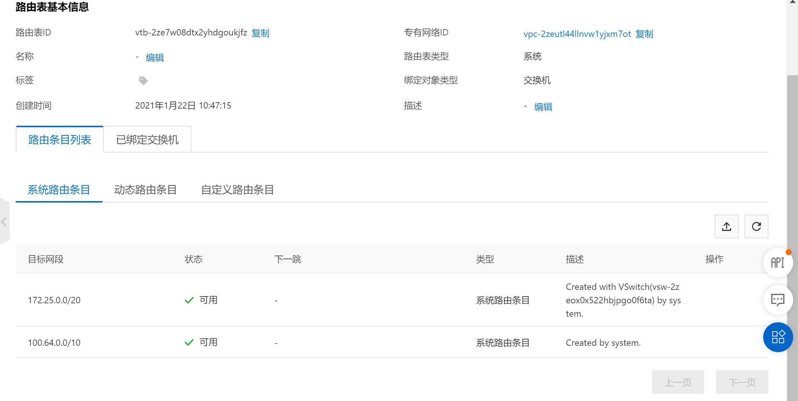
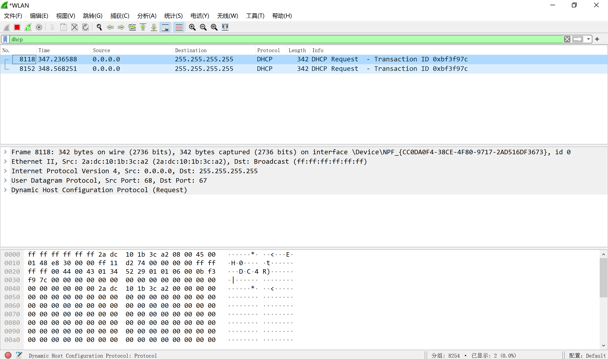
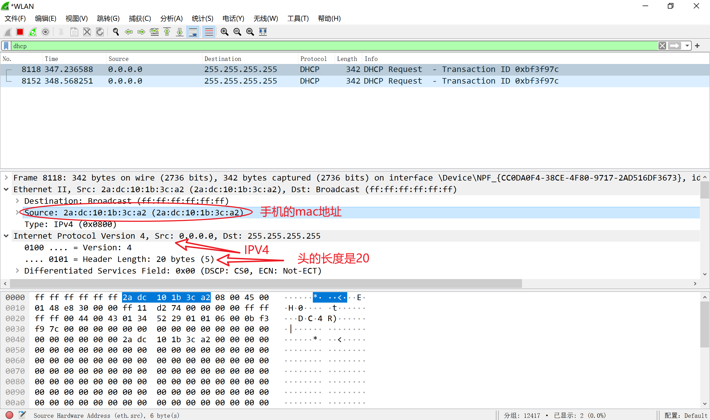

# 计算机网络概论

- [计算机网络概论](#计算机网络概论)
  - [查看IP地址](#查看ip地址)
    - [Windows](#windows)
      - [眼见不为实](#眼见不为实)
    - [Linux](#linux)
      - [ifconfig](#ifconfig)
      - [ip addr](#ip-addr)
    - [无类型域间选路（CIDR）](#无类型域间选路cidr)
      - [子网掩码](#子网掩码)
      - [广播地址](#广播地址)
      - [公有IP和私有IP](#公有ip和私有ip)
    - [Mac地址](#mac地址)
      - [Mac地址为何不能替换IP地址的功能？](#mac地址为何不能替换ip地址的功能)
      - [Mac地址的定位功能](#mac地址的定位功能)
    - [网络设备的状态标识](#网络设备的状态标识)
  - [动态主机配置协议(DHCP)](#动态主机配置协议dhcp)
    - [如何配置 IP 地址](#如何配置-ip-地址)
    - [为何需要DHCP](#为何需要dhcp)
    - [DHCP如何工作](#dhcp如何工作)
    - [IP 地址的收回和续租](#ip-地址的收回和续租)
    - [DHCP抓包](#dhcp抓包)
    - [预启动执行环境（PXE）](#预启动执行环境pxe)
  - [结语](#结语)

1. 网络结构
2. 查看IP
3. DHCP
4. ARP请求、ICMP请求
5. NAT网关
6. 动态路由算法

## 查看IP地址

游戏CS联机连不上怎么办

### Windows

```powershell
$ipconfig
```

- 以下是一台装了Vmware的Windows

```powershell
PS C:\Users\Administrator> ipconfig

Windows IP 配置


以太网适配器 cfw-tap:

   媒体状态  . . . . . . . . . . . . : 媒体已断开连接
   连接特定的 DNS 后缀 . . . . . . . :

无线局域网适配器 本地连接* 1:

   媒体状态  . . . . . . . . . . . . : 媒体已断开连接
   连接特定的 DNS 后缀 . . . . . . . :

以太网适配器 VMware Network Adapter VMnet1:

   连接特定的 DNS 后缀 . . . . . . . :
   本地链接 IPv6 地址. . . . . . . . : fe80::5cc6:71e1:447e:72a1%18
   自动配置 IPv4 地址  . . . . . . . : 169.254.114.161
   子网掩码  . . . . . . . . . . . . : 255.255.0.0
   默认网关. . . . . . . . . . . . . :

以太网适配器 VMware Network Adapter VMnet8:

   连接特定的 DNS 后缀 . . . . . . . :
   本地链接 IPv6 地址. . . . . . . . : fe80::dcff:65bb:8e2:99b8%25
   IPv4 地址 . . . . . . . . . . . . : 192.168.88.1
   子网掩码  . . . . . . . . . . . . : 255.255.255.0
   默认网关. . . . . . . . . . . . . :

无线局域网适配器 WLAN:

   连接特定的 DNS 后缀 . . . . . . . : lan
   本地链接 IPv6 地址. . . . . . . . : fe80::2c18:17cc:5b29:2f9a%22
   IPv4 地址 . . . . . . . . . . . . : 192.168.2.204
   子网掩码  . . . . . . . . . . . . : 255.255.255.0
   默认网关. . . . . . . . . . . . . : 192.168.2.1

以太网适配器 蓝牙网络连接:

   媒体状态  . . . . . . . . . . . . : 媒体已断开连接
   连接特定的 DNS 后缀 . . . . . . . :
```

#### 眼见不为实

- [为什么百度搜索查询出来的IP地址和用电脑查询的IP地址不一样，哪个是正确的？ - 车小胖的回答 - 知乎](https://www.zhihu.com/question/66785037/answer/282161570)

- NAT：《自顶向下》4.3.4 网络地址转换

### Linux

#### ifconfig

```shell
youhuangla@Ubuntu os_prog % ifconfig                                                                                [0]
#docker网卡
docker0: flags=4099<UP,BROADCAST,MULTICAST>  mtu 1500
        inet 172.17.0.1  netmask 255.255.0.0  broadcast 172.17.255.255
        inet6 fe80::42:13ff:fea6:bfe9  prefixlen 64  scopeid 0x20<link>
        ether 02:42:13:a6:bf:e9  txqueuelen 0  (Ethernet)
        RX packets 0  bytes 0 (0.0 B)
        RX errors 0  dropped 0  overruns 0  frame 0
        TX packets 2  bytes 176 (176.0 B)
        TX errors 0  dropped 0 overruns 0  carrier 0  collisions 0

eth0: flags=4163<UP,BROADCAST,RUNNING,MULTICAST>  mtu 1500
        inet 172.25.12.114#内网ip
        netmask 255.255.240.0  broadcast 172.25.15.255
        inet6 fe80::216:3eff:fe36:562a  prefixlen 64  scopeid 0x20<link>
        ether 00:16:3e:36:56:2a  txqueuelen 1000  (Ethernet)
        RX packets 18579865  bytes 8461363783 (8.4 GB)
        RX errors 0  dropped 0  overruns 0  frame 0
        TX packets 15600818  bytes 3551604027 (3.5 GB)
        TX errors 0  dropped 0 overruns 0  carrier 0  collisions 0
#io回环网卡
lo: flags=73<UP,LOOPBACK,RUNNING>  mtu 65536
        inet 127.0.0.1  netmask 255.0.0.0
        inet6 ::1  prefixlen 128  scopeid 0x10<host>
        loop  txqueuelen 1000  (Local Loopback)
        RX packets 2378789  bytes 202305094 (202.3 MB)
        RX errors 0  dropped 0  overruns 0  frame 0
        TX packets 2378789  bytes 202305094 (202.3 MB)
        TX errors 0  dropped 0 overruns 0  carrier 0  collisions 0
```

- 阿里云主机的IP

  - 路由表

  

  - 专有网络

  

  - 交换机


#### ip addr

```shell
youhuangla@Ubuntu os_prog % ip addr                                                                                 [0]
1: lo: <LOOPBACK,UP,LOWER_UP> mtu 65536 qdisc noqueue state UNKNOWN group default qlen 1000
    link/loopback 00:00:00:00:00:00 brd 00:00:00:00:00:00
    inet 127.0.0.1/8 scope host lo
       valid_lft forever preferred_lft forever
    inet6 ::1/128 scope host
       valid_lft forever preferred_lft forever
2: eth0: <BROADCAST,MULTICAST,UP,LOWER_UP> mtu 1500 qdisc fq_codel state UP group default qlen 1000
    link/ether 00:16:3e:36:56:2a brd ff:ff:ff:ff:ff:ff
    inet 172.25.12.114/20 brd 172.25.15.255 scope global dynamic eth0
       valid_lft 289695723sec preferred_lft 289695723sec
    inet6 fe80::216:3eff:fe36:562a/64 scope link
       valid_lft forever preferred_lft forever
3: docker0: <NO-CARRIER,BROADCAST,MULTICAST,UP> mtu 1500 qdisc noqueue state DOWN group default
    link/ether 02:42:13:a6:bf:e9 brd ff:ff:ff:ff:ff:ff
    inet 172.17.0.1/16 brd 172.17.255.255 scope global docker0
       valid_lft forever preferred_lft forever
    inet6 fe80::42:13ff:fea6:bfe9/64 scope link
       valid_lft forever preferred_lft forever
```

- [大部分内容引用自：《趣谈网络协议》(geekbang.org)](https://time.geekbang.org/column/intro/85)
- 这个命令显示了这台机器上所有的网卡。大部分的网卡都会有一个 IP地址。
- IP 地址是一个网卡在网络世界的通讯地址，相当于我们现实世界的门牌号码。
- 既然是门牌号码，不能大家都一样，不然就会起冲突。比方说，假如大家都叫六单元 1001号，那快递就找不到地方了。所以，有时候咱们的电脑弹出网络地址冲突，出现上不去网的情况，多半是 IP地址冲突了。

- 本来 32 位的 IP 地址就不够，还被分成了 5 类。现在想想，当时分配地址的时候，真是太奢侈了


- 下面这个表格，详细地展示了 A、B、C 三类地址所能包含的主机的数量


$$
2^{24}=16777216\\
2^{16}=65536\\
2^{8}=256
$$

- 可以看到最大主机数 = 2^主机号 - 2，这里的2分别是全0和全1
- 减2 的原因是：第一，IP 地址中的全0 表示
“这个(this)”。网络号字段为全0 的IP 地址是个保留地址，意思是“本网络”；第二，网络
号为127（即01111111）保留作为本地软件环回测试(loopback test)本主机的进程之间的通信
之用。若主机发送一个目的地址为环回地址（例如127.0.0.1）的IP 数据报，则本主机中的
协议软件就处理数据报中的数据，而不会把数据报发送到任何网络。目的地址为环回地址的
IP 数据报永远不会出现在任何网络上，因为网络号为127 的地址根本不是一个网络地址——《谢希仁计网》p120
- 这里面有个尴尬的事情，就是 C 类地址能包含的最大主机数量实在太少了，只有 254 个。当时设计的时
  候恐怕没想到，现在估计一个网吧都不够用吧。而 B 类地址能包含的最大主机数量又太多了。6 万多台
  机器放在一个网络下面，一般的企业基本达不到这个规模，闲着的地址就是浪费。
- #可以看出，每个小段"."与"."之间的数字最大为256，即16 * 16，可以看做两位16进制。

### 无类型域间选路（CIDR）

- 于是有了一个折中的方式叫作无类型域间选路，简称CIDR。这种方式打破了原来设计的几类地址的做
  法，将 32 位的 IP 地址一分为二，前面是网络号，后面是主机号。从哪里分呢？你如果注意观察的话可
  以看到，10.100.122.2/24，这个 IP 地址中有一个斜杠，斜杠后面有个数字 24。这种地址表示形式，就
  是 CIDR。后面 24 的意思是，32 位中，前 24 位是网络号，后 8 位是主机号。
- 伴随着 CIDR 存在的，一个是广播地址，10.100.122.255。如果发送这个地址，所有 10.100.122 网络
  里面的机器都可以收到。另一个是子网掩码，255.255.255.0。
- 将子网掩码和 IP 地址进行 AND 计算。前面三个 255，转成二进制都是 1。1 和任何数值取 AND，都是
  原来数值，因而前三个数不变，为 10.100.122。后面一个 0，转换成二进制是 0，0 和任何数值取
  AND，都是 0，因而最后一个数变为 0，合起来就是 10.100.122.0。这就是网络号。将子网掩码和 IP
  地址按位计算 AND，就可得到网络号。

- #`ip addr`中的类似`inet 172.25.12.114/20`即为CIDR
- #`ifconfig`中的`inet 172.17.0.1  netmask 255.255.0.0  broadcast 172.17.255.255`里的netmask是子网掩码，broadcast是广播地址

#### 子网掩码

- 谢希仁计网p119
- IP 编址为这个
子网分配一个地址223. l. 1. 0/ 24 , 其中的
/24 记法，有时称为子网掩码(network
mask ) , 指示32 比特中的最左侧24 比特
定义了子网地址。——《自顶向下第七版》p218

#### 广播地址

- 如果还不提及另一种类型的IP 地址．即IP 广播地址255.255.255.255, 那将是我们的疏漏。当一台主机发出一个目的地址为255.255.255. 255 的数据报时，该报文会交付给同一个网络中的所有主机——《自顶向下第七版》p221

#### 公有IP和私有IP


- 我们继续看上面的表格。表格最右列是私有 IP 地址段。平时我们看到的数据中心里，办公室、家里或学
  校的 IP 地址，一般都是私有 IP 地址段。因为这些地址允许组织内部的 IT 人员自己管理、自己分配，而
  且可以重复。因此，你学校的某个私有 IP 地址段和我学校的可以是一样的。
  
- 这就像每个小区有自己的楼编号和门牌号，你们小区可以叫 6 栋，我们小区也叫 6 栋，没有任何问题。
  但是一旦出了小区，就需要使用公有 IP 地址。就像人民路 888 号，是国家统一分配的，不能两个小区
  都叫人民路 888 号。
  
- 公有 IP 地址有个组织统一分配，你需要去买。如果你搭建一个网站，给你学校的人使用，让你们学校的
  IT 人员给你一个 IP 地址就行。但是假如你要做一个类似网易 163 这样的网站，就需要有公有 IP 地址，
  这样全世界的人才能访问。
  
- 表格中的 192.168.0.x 是最常用的私有 IP 地址。你家里有 Wi-Fi，对应就会有一个 IP 地址。一般你家里  地上网设备不会超过 256 个，所以 /24 基本就够了。有时候我们也能见到 /16 的 CIDR，这两种是最常见的，也是最容易理解的。
  
- 不需要将十进制转换为二进制 32 位，就能明显看出 192.168.0 是网络号，后面是主机号。而整个网络里面的第一个地址 192.168.0.1，往往就是你这个私有网络的出口地址。例如，你家里的电脑连接 Wi-Fi，Wi-Fi 路由器的地址就是 192.168.0.1，而 192.168.0.255 就是广播地址。一旦发送这个地址，整个192.168.0 网络里面的所有机器都能收到。

  <u>Q:</u>16.158.165.91／22 这个 CIDR。求一下这个网络的第一个地址、子网掩码和广播地址。

  <u>A:</u>
  
  - #每个小段是8位2进制， 3 * 8 = 24，故需要在165该段划分，去掉最后两位二进制
  
  $$
  165=10100101_2\\
  10100100100_2=164
  $$

  - 网络号为16.158.164.0
  - 第一个地址为16.158.164.1
  - 子网掩码255.255.252，去掉最后两位二进制，位数全1，见[子网掩码](#子网掩码)
  - 广播地址16.158.164.255

### Mac地址

见[ifconfig](#ifconfig)
`inet6 fe80::216:3eff:fe36:562a  prefixlen 64  scopeid 0x20<link>`

- 在 IP 地址的上一行是 link/ether fa:16:3e:c7:79:75 brd ff:ff:ff:ff:ff:ff，这个被称为MAC 地址，是一个网卡的物理地址，用十六进制，6 个 byte 表示。

#### Mac地址为何不能替换IP地址的功能？

- MAC 地址是一个很容易让人“误解”的地址。因为 MAC 地址号称全局唯一，不会有两个网卡有相同的MAC 地址，而且网卡自生产出来，就带着这个地址。很多人看到这里就会想，既然这样，整个互联网的通信，全部用 MAC 地址好了，只要知道了对方的 MAC 地址，就可以把信息传过去。
- 这样当然是不行的。一个网络包要从一个地方传到另一个地方，除了要有确定的地址，还需要有定位功能。而有门牌号码属性的 IP 地址，才是有远程定位功能的。
- 例如，你去杭州市网商路 599 号 B 楼 6 层找刘超，你在路上问路，可能被问的人不知道 B 楼是哪个，但是可以给你指网商路怎么去。但是如果你问一个人，你知道这个身份证号的人在哪里吗？可想而知，没有人知道。
- MAC 地址更像是身份证，是一个唯一的标识。它的唯一性设计是为了组网的时候，不同的网卡放在一个网络里面的时候，可以不用担心冲突。从硬件角度，保证不同的网卡有不同的标识。

#### Mac地址的定位功能

- MAC 地址是有一定定位功能的，只不过范围非常有限。你可以根据 IP 地址，找到杭州市网商路 599 号B 楼 6 层，但是依然找不到我，你就可以靠吼了，大声喊身份证 XXXX 的是哪位？我听到了，我就会站起来说，是我啊。但是如果你在上海，到处喊身份证 XXXX 的是哪位，我不在现场，当然不会回答，因为我在杭州不在上海。
- 所以，MAC 地址的通信范围比较小，局限在一个子网里面。例如，从 192.168.0.2/24 访问192.168.0.3/24 是可以用 MAC 地址的。一旦跨子网，即从 192.168.0.2/24 到 192.168.1.2/24，MAC地址就不行了，需要 IP 地址起作用了。

### 网络设备的状态标识

[ipconfig](#ipconfig)

`2: eth0: <BROADCAST,MULTICAST,UP,LOWER_UP> mtu 1500 qdisc fq_codel state UP group default qlen 1000`

解析完了 MAC 地址，我们再来看 `<BROADCAST,MULTICAST,UP,LOWER_UP>` 是干什么的？这个叫作net_device flags，网络设备的状态标识。

- UP 表示网卡处于启动的状态；
- BROADCAST 表示这个网卡有广播地址，可以发送广播包；
- MULTICAST表示网卡可以发送多播包；
- LOWER_UP 表示 L1 是启动的，也即网线插着呢。

MTU1500 是指什么意思呢？是哪一层的概念呢？最大传输单元 MTU 为 1500，这是以太网的默认值。我们讲过网络包是层层封装的。MTU 是二层 MAC 层的概念。MAC 层有 MAC 的头，以太网规定连 MAC 头带正文合起来，不允许超过 1500 个字节。正文里面有 IP 的头、TCP 的头、HTTP 的头。如果放不下，就需要分片来传输。

qdisc pfifo_fast

- qdisc 全称是queueing discipline，中文叫排队规则。内核如果需要通过某个网络接口发送数据包，它都需要按照为这个接口配置的 qdisc（排队规则）把数据包加入队列。
- 最简单的 qdisc 是 pfifo，它不对进入的数据包做任何的处理，数据包采用先入先出的方式通过队列。pfifo_fast 稍微复杂一些，它的队列包括三个波段（band）。在每个波段里面，使用先进先出规则。
- 三个波段（band）的优先级也不相同。band 0 的优先级最高，band 2 的最低。如果 band 0 里面有数据包，系统就不会处理 band 1 里面的数据包，band 1 和 band 2 之间也是一样。
- 数据包是按照服务类型（Type of Service，TOS）被分配多三个波段（band）里面的。TOS 是 IP 头里面的一个字段，代表了当前的包是高优先级的，还是低优先级的。
- 队列是个好东西，在讲云计算中的网络的时候，会有很多用户共享一个网络出口的情况，这个时候如何排队，每个队列有多粗，队列处理速度应该怎么提升，我都会详细为你讲解。

## 动态主机配置协议(DHCP)

我要租房子

- 上一节，我们讲了 IP 的一些基本概念。如果需要和其他机器通讯，我们就需要一个通讯地址，我们需要给网卡配置这么一个地址。

### 如何配置 IP 地址

那如何配置呢？如果有相关的知识和积累，你可以用命令行自己配置一个地址。可以使用 ifconfig，也可以使用 ip addr。设置好了以后，用这两个命令，将网卡 up 一下，就可以开始工作了。
使用 net-tools：

```shell
sudo ifconfig eth1 10.0.0.1/24
sudo ifconfig eth1 up
```

使用 iproute2：

```shell
sudo ip addr add 10.0.0.1/24 dev eth1
sudo ip link set up eth1
```

- 你可能会问了，自己配置这个自由度太大了吧，我是不是配置什么都可以？如果配置一个和谁都不搭边的地址呢？例如，旁边的机器都是 192.168.1.x，我非得配置一个 16.158.23.6，会出现什么现象呢？

- 不会出现任何现象，就是包发不出去呗。为什么发不出去呢？我来举例说明。
- 192.168.1.6 就在你这台机器的旁边，甚至是在同一个交换机上，而你把机器的地址设为了16.158.23.6。在这台机器上，你企图去 ping192.168.1.6，你觉得只要将包发出去，同一个交换机的另一台机器马上就能收到，对不对？可是 Linux 系统不是这样的，它没你想得那么智能。你用肉眼看到那台机器就在旁边，它则需要根据自己的逻辑进行处理。
- 还记得我们在第二节说过的原则吗？只要是在网络上跑的包，都是完整的，可以有下层没上层，绝对不可能有上层没下层。
- 所以，你看着它有自己的源 IP 地址 16.158.23.6，也有目标 IP 地址 192.168.1.6，但是包发不出去，这是因为 MAC 层还没填。
- 自己的 MAC 地址自己知道，这个容易。但是目标 MAC 填什么呢？是不是填 192.168.1.6 这台机器的MAC 地址呢？
- 当然不是。Linux 首先会判断，要去的这个地址和我是一个网段的吗，或者和我的一个网卡是同一网段的吗？只有是一个网段的，它才会发送 ARP 请求，获取 MAC 地址。如果发现不是呢？
- Linux 默认的逻辑是，如果这是一个跨网段的调用，它便不会直接将包发送到网络上，而是企图将包发送到网关。如果你配置了网关的话，Linux 会获取网关的 MAC 地址，然后将包发出去。对于 192.168.1.6 这台机器来讲，虽然路过它家门的这个包，目标 IP 是它，但是无奈 MAC 地址不是它的，所以它的网卡是不会把包收进去的。
- 如果没有配置网关呢？那包压根就发不出去。
- 如果将网关配置为 192.168.1.6 呢？不可能，Linux 不会让你配置成功的，因为网关要和当前的网络至少一个网卡是同一个网段的，怎么可能 16.158.23.6 的网关是 192.168.1.6 呢？
- 所以，当你需要手动配置一台机器的网络 IP 时，一定要好好问问你的网络管理员。如果在机房里面，要去网络管理员那里申请，让他给你分配一段正确的 IP 地址。当然，真正配置的时候，一定不是直接用命令配置的，而是放在一个配置文件里面。不同系统的配置文件格式不同，但是无非就是 CIDR、子网掩码、广播地址和网关地址。

### 为何需要DHCP

- 原来配置 IP 有这么多门道儿啊。你可能会问了，配置了 IP 之后一般不能变的，配置一个服务端的机器还可以，但是如果是客户端的机器呢？我抱着一台笔记本电脑在公司里走来走去，或者白天来晚上走，每次使用都要配置 IP 地址，那可怎么办？还有人事、行政等非技术人员，如果公司所有的电脑都需要 IT人员配置，肯定忙不过来啊。因此，我们需要有一个自动配置的协议，也就是称动态主机配置协议（Dynamic Host Configuration Protocol），简称DHCP。
- 有了这个协议，网络管理员就轻松多了。他只需要配置一段共享的 IP 地址。每一台新接入的机器都通过DHCP 协议，来这个共享的 IP 地址里申请，然后自动配置好就可以了。等人走了，或者用完了，还回去，这样其他的机器也能用。
- 所以说，如果是数据中心里面的服务器，IP 一旦配置好，基本不会变，这就相当于买房自己装修。
- DHCP 的方式就相当于租房。你不用装修，都是帮你配置好的。你暂时用一下，用完退租就可以了。

### DHCP如何工作

- 当一台机器新加入一个网络的时候，肯定一脸懵，啥情况都不知道，只知道自己的 MAC 地址。怎么办？先吼一句，我来啦，有人吗？这时候的沟通基本靠“吼”。这一步，我们称为DHCP Discover。
- 新来的机器使用 IP 地址 0.0.0.0 发送了一个广播包，目的 IP 地址为 255.255.255.255。广播包封装在UDP 里面，UDP 封装在 BOOTP 里面。其实 DHCP 是 BOOTP 的增强版，但是如果你去抓包的话，很可能看到的名称还是 BOOTP 协议。
- 在这个广播包里面，新人大声喊：我是新来的（Boot request），我的 MAC 地址是这个，我还没有IP，谁能给租给我个 IP 地址！
- 格式就像这样：


- 如果一个网络管理员在网络里面配置了DHCP Server的话，他就相当于这些 IP 的管理员。他立刻能知道来了一个“新人”。这个时候，我们可以体会 MAC 地址唯一的重要性了。当一台机器带着自己的 MAC地址加入一个网络的时候，MAC 是它唯一的身份，如果连这个都重复了，就没办法配置了。
- 只有 MAC 唯一，IP 管理员才能知道这是一个新人，需要租给它一个 IP 地址，这个过程我们称为DHCP Offer。同时，DHCP Server 为此客户保留为它提供的 IP 地址，从而不会为其他 DHCP 客户分配此 IP地址。
- DHCP Offer 的格式就像这样，里面有给新人分配的地址。


- DHCP Server 仍然使用广播地址作为目的地址，因为，此时请求分配 IP 的新人还没有自己的 IP。
- DHCP Server 回复说，我分配了一个可用的 IP 给你，你看如何？除此之外，服务器还发送了子网掩码、网关和 IP 地址租用期等信息。
- 新来的机器很开心，它的“吼”得到了回复，并且有人愿意租给它一个 IP 地址了，这意味着它可以在网络上立足了。当然更令人开心的是，如果有多个 DHCP Server，这台新机器会收到多个 IP 地址，简直受宠若惊。
- 它会选择其中一个 DHCP Offer，一般是最先到达的那个，并且会向网络发送一个 DHCP Request 广播数据包，包中包含客户端的 MAC 地址、接受的租约中的 IP 地址、提供此租约的 DHCP 服务器地址等，并告诉所有 DHCP Server 它将接受哪一台服务器提供的 IP 地址，告诉其他 DHCP 服务器，谢谢你们的接纳，并请求撤销它们提供的 IP 地址，以便提供给下一个 IP 租用请求者。


- 此时，由于还没有得到 DHCP Server 的最后确认，客户端仍然使用 0.0.0.0 为源 IP 地址、255.255.255.255 为目标地址进行广播。在 BOOTP 里面，接受某个 DHCP Server 的分配的 IP。
- 当 DHCP Server 接收到客户机的 DHCP request 之后，会广播返回给客户机一个 DHCP ACK 消息包，表明已经接受客户机的选择，并将这一 IP 地址的合法租用信息和其他的配置信息都放入该广播包，发给客户机，欢迎它加入网络大家庭。


- 最终租约达成的时候，还是需要广播一下，让大家都知道。

### IP 地址的收回和续租

- 既然是租房子，就是有租期的。租期到了，管理员就要将 IP 收回。
- 如果不用的话，收回就收回了。就像你租房子一样，如果还要续租的话，不能到了时间再续租，而是要提前一段时间给房东说。DHCP 也是这样。
- 客户机会在租期过去 50% 的时候，直接向为其提供 IP 地址的 DHCP Server 发送 DHCP request 消息包。客户机接收到该服务器回应的 DHCP ACK 消息包，会根据包中所提供的新的租期以及其他已经更新的 TCP/IP 参数，更新自己的配置。这样，IP 租用更新就完成了。
- 好了，一切看起来完美。DHCP 协议大部分人都知道，但是其实里面隐藏着一个细节，很多人可能不会去注意。接下来，我就讲一个有意思的事情：网络管理员不仅能自动分配 IP 地址，还能帮你自动安装操作系统(见[PXE](#预启动执行环境（PXE）))！

### DHCP抓包

- 实验环境：Wireshark
- 选择接口：WLAN，抓包


- 可以看到，有很多包，如何选择我们想要的dhcp包？


- 选择了DHCP，但是似乎并没有包，如何产生包？
- （之前连上的断开）并用手机连接与电脑相同的局域网络。
- 这里可能会抓到两个（四个？不确定）包，在Info一栏可以看到我抓到了两个DHCP Request包，有人可能可以抓到Discover包（等？）



- 点击第一个查看包内的信息（中间一栏）




### 预启动执行环境（PXE）


## 结语

- IP 是地址，有定位功能；MAC 是身份证，无定位功能；
- CIDR 可以用来判断是不是本地人；
- IP 分公有的 IP 和私有的 IP。后面的章节中会谈到“出国门”，就与这个有关。
- DHCP 协议主要是用来给客户租用 IP 地址，和房产中介很像，要商谈、签约、续租，广播还不能“抢单”；
- DHCP 协议能给客户推荐“装修队”PXE，能够安装操作系统，这个在云计算领域大有用处。

玩着学，学着玩。
