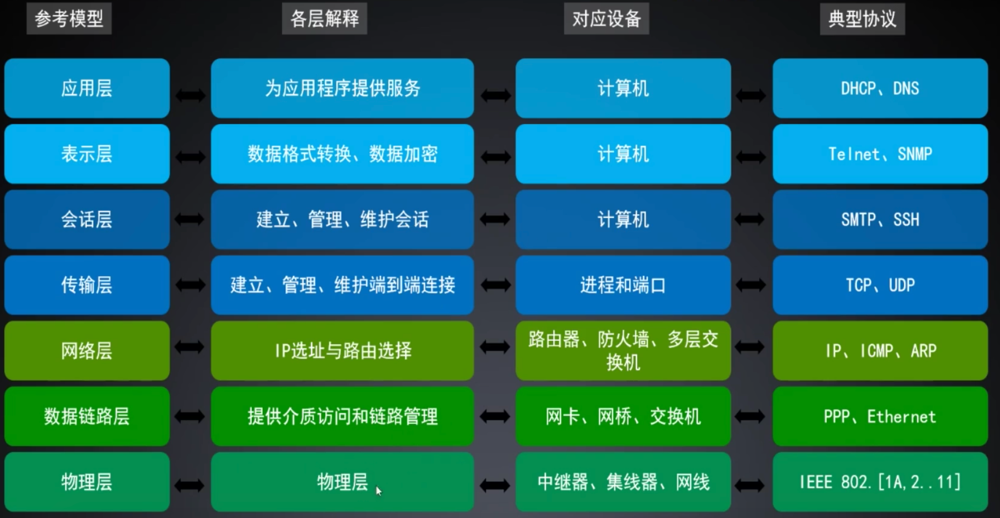
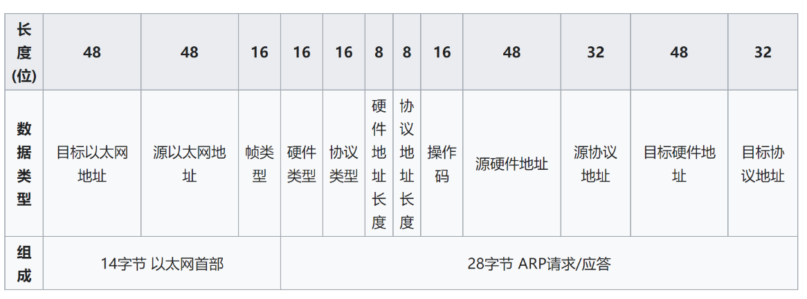

# 计算机网络协议

- [计算机网络协议](#计算机网络协议)
  - [协议](#协议)
    - [OSI七层模型：开放式系统互联参考模型](#osi七层模型开放式系统互联参考模型)
    - [TCP/IP五层模型](#tcpip五层模型)
  - [物理层的网线](#物理层的网线)
    - [两台电脑的联机](#两台电脑的联机)
    - [三台电脑的联机](#三台电脑的联机)
  - [链路层的三个问题](#链路层的三个问题)
    - [饭店确认客人身份？](#饭店确认客人身份)
    - [饭店让骑手出门时间怎么定？](#饭店让骑手出门时间怎么定)
      - [信道划分,轮流协议,随机接入协议](#信道划分轮流协议随机接入协议)
    - [送的饭如何确认有没送错？](#送的饭如何确认有没送错)
  - [网络层的ARP协议](#网络层的arp协议)
    - [ARP协议](#arp协议)
      - [IP到MAC全靠吼](#ip到mac全靠吼)
        - [ARP数据报格式](#arp数据报格式)
      - [ARP抓包](#arp抓包)
        - [ARP Request你在哪里？](#arp-request你在哪里)
          - [手机重连WIFI](#手机重连wifi)
        - [ARP Reply我在这里](#arp-reply我在这里)
          - [Logitech flow(一鼠双机)看ARP协议](#logitech-flow一鼠双机看arp协议)
      - [ARP表](#arp表)
        - [Windows](#windows)
        - [Linux](#linux)
  - [数据链路层的集线器与交换机](#数据链路层的集线器与交换机)
    - [集线器(Hub)](#集线器hub)
    - [交换机](#交换机)
      - [引入交换机的理由](#引入交换机的理由)
      - [勤奋画地图的交换机](#勤奋画地图的交换机)
      - [交换机的地图:转发表](#交换机的地图转发表)

## 协议

- 什么是协议？
- 游戏规则
- 语法：就是这一段内容要符合一定的规则和格式。例如，这一部分写几个字节，下一个部分写几个字节。
- 语义：就是这一段内容要代表某种意义。例如这几个字节什么意思，那几个字节什么意思，代表什么。
- 顺序：就是先干啥，后干啥。例如，先请求租房子，后提供offer，在请求签合同，最后确认合同成立并公示。

### OSI七层模型：开放式系统互联参考模型



- 从下到上越来越复杂，上层实现对下层的封装

### TCP/IP五层模型


## 物理层的网线

### 两台电脑的联机

- 我们要的是电脑连电脑。这种方式就是一根网线，有两个头。一头插在一台电脑的网卡上，另一头插在另一台电脑的网卡上。但是在当时，普通的网线这样是通不了的，所以水晶头要做交叉线，用的就是所谓的1－3、2－6 交叉接法。
- 水晶头的第 1、2 和第 3、6 脚，它们分别起着收、发信号的作用。将一端的 1 号和 3 号线、2 号和 6号线互换一下位置，就能够在物理层实现一端发送的信号，另一端能收到。
- 当然电脑连电脑，除了网线要交叉，还需要配置这两台电脑的 IP 地址、子网掩码和默认网关。这三个概念上一节详细描述过了。要想两台电脑能够通信，这三项必须配置成为一个网络，可以一个是192.168.0.1/24，另一个是 192.168.0.2/24，否则是不通的。
- 这里我想问你一个问题，两台电脑之间的网络包，包含 MAC 层吗？当然包含，要完整。IP 层要封装了MAC 层才能将包放入物理层。
- 到此为止，两台电脑已经构成了一个最小的局域网，也即LAN。可以玩联机局域网游戏啦！

### 三台电脑的联机

- 等到第三个哥们也买了一台电脑，怎么把三台电脑连在一起呢？

- 先别说交换机，当时交换机也贵。有一个叫作Hub的东西，也就是集线器。这种设备有多个口，可以将宿舍里的多台电脑连接起来。但是，和交换机不同，集线器没有大脑，它完全在物理层工作。它会将自己收到的每一个字节，都复制到其他端口上去。这是第一层物理层联通的方案。

- Hub 采取的是广播的模式，如果每一台电脑发出的包，宿舍的每个电脑都能收到，那就麻烦了。这就需要解决几个问题：

1. 这个包是发给谁的？谁应该接收？#对象
2. 大家都在发，会不会产生混乱？有没有谁先发、谁后发的规则？#顺序
3. 如果发送的时候出现了错误，怎么办？#内容

- 这几个问题，都是第二层，数据链路层，也即 MAC 层要解决的问题。

## 链路层的三个问题

外卖配送

### 饭店确认客人身份？

- 第一个问题：发给谁，谁接收？这里用到一个物理地址，叫作链路层地址。但是因为第二层主要解决媒体接入控制的问题，所以它常被称为MAC地址。#身份证

- 解决第一个问题就牵扯到第二层的网络包格式。对于以太网，第二层的最开始，就是目标的 MAC 地址和源的 MAC 地址。


- 接下来是类型，大部分的类型是 IP 数据包，然后 IP 里面包含 TCP、UDP，以及 HTTP 等，这都是里层封装的事情。有了这个目标 MAC 地址，数据包在链路上广播，MAC 的网卡才能发现，这个包是给它的。MAC 的网卡把包收进来，然后打开 IP 包，发现 IP 地址也是自己的，再打开 TCP 包，发现端口是自己，也就是80，而 nginx 就是监听 80。
- 于是将请求提交给 nginx，nginx 返回一个网页。然后将网页需要发回请求的机器。然后层层封装，最后到 MAC 层。因为来的时候有源 MAC 地址，返回的时候，源 MAC 就变成了目标 MAC，再返给请求的机器。

### 饭店让骑手出门时间怎么定？

- MAC层中的MAC的全称是Medium Access Control，即媒体访问控制。控制什么呢？其实就是控制在往媒体上发数据的时候，谁先发、谁后发的问题。防止发生混乱。这解决的是第二个问题。这个问题中的规则，学名叫多路访问。有很多算法可以解决这个问题。就像车管所管束马路上跑的车，能想的办法都想过了。
- 比如接下来这三种方式：

#### 信道划分,轮流协议,随机接入协议

1. 分多个车道。每个车一个车道，你走你的，我走我的。这在计算机网络里叫作信道划分；
2. 今天单号出行，明天双号出行，轮着来。这在计算机网络里叫作轮流协议；
3. 不管三七二十一，有事儿先出门，发现特堵，就回去。错过高峰再出。我们叫作随机接入协议。著名的以太网，用的就是这个方式。

### 送的饭如何确认有没送错？

- 对于以太网，第二层的最后面是CRC，也就是循环冗余检测。通过 XOR 异或的算法，来计算整个包是否在发送的过程中出现了错误，主要解决第三个问题。
- 这里还有一个没有解决的问题，当源机器知道目标机器的时候，可以将目标地址放入包里面，如果不知道呢？一个广播的网络里面接入了 N 台机器，我怎么知道每个 MAC 地址是谁呢？这就是ARP协议[见ARP请求](#ARP请求)，也就是已知 IP 地址，求 MAC 地址的协议。

## 网络层的ARP协议

### ARP协议

- #客人，你在哪里？

#### IP到MAC全靠吼

在一个局域网里面，当知道了 IP 地址，不知道 MAC 怎么办呢？靠“吼”。


- 广而告之，发送一个广播包，谁是这个 IP 谁来回答。具体询问和回答的报文就像下面这样：

##### ARP数据报格式


- 为了避免每次都用 ARP 请求，机器本地也会进行 ARP 缓存。当然机器会不断地上线下线，IP 也可能会变，所以 ARP 的 MAC 地址缓存过一段时间就会过期。



- ——[地址解析协议报文格式](https://zh.wikipedia.org/wiki/%E5%9C%B0%E5%9D%80%E8%A7%A3%E6%9E%90%E5%8D%8F%E8%AE%AE)

#### ARP抓包

- 打开Wireshark输入arp开始抓包
- Linux可参考[ARP 地址解析协议 教程](https://segmentfault.com/a/1190000000468255)

##### ARP Request你在哪里？

- ping局域网子网内一个不存在的IP地址，如我的是192.169.2.204(见[ARP表的Windows](#windows)和[s17计算机网络概论.md中windows一章](./s17计算机网络概论.md))，子网掩码为255.255.255.0，所以我可以ping 192.168.2.0子网内的192.168.2.222这个并不存在的IP地址，来寻找一个ARP Request。一般来说可能是192.168.1.0，但是为什么我的是2？可能和该路由器是经由另一个路由器连接网络有关。
- [why ip 192.168.1.1 is default ip for routers?](https://stackoverflow.com/questions/50190690/why-ip-192-168-1-1-is-default-ip-for-routers)
- TODO：罗技鼠标在两台电脑间的通信

```powershell
PS C:\Users\Administrator> ping 192.168.2.222

正在 Ping 192.168.2.222 具有 32 字节的数据:
来自 192.168.2.204 的回复: 无法访问目标主机。
来自 192.168.2.204 的回复: 无法访问目标主机。
来自 192.168.2.204 的回复: 无法访问目标主机。
来自 192.168.2.204 的回复: 无法访问目标主机。

192.168.2.222 的 Ping 统计信息:
    数据包: 已发送 = 4，已接收 = 4，丢失 = 0 (0% 丢失)，
```


- 上图就是ping之后抓包的结果了，对照[APR数据报格式](#arp数据报格式)可以很清晰的明白每一项的含义

###### 手机重连WIFI

- 断开并重连和你的电脑连在同一个WIFI的手机的WIFI。抓包


- 看出有一个特殊的的ARP包——[ARP announcement](https://en.wikipedia.org/wiki/Address_Resolution_Protocol#ARP_announcements)
- 这里为什么没有ARP Request呢？难道是iPhone的问题，待续。。。


##### ARP Reply我在这里

###### Logitech flow(一鼠双机)看ARP协议

- [logitech flow](https://www.logitech.com.cn/zh-cn/software/features/flow.html)中看ARP Reply

```iTerm
mac126deAir:~ mac126$ ifconfig
en0: flags=8863<UP,BROADCAST,SMART,RUNNING,SIMPLEX,MULTICAST> mtu 1500
options=400<CHANNEL_IO>
ether 88:e9:fe:68:65:a7
inet6 fe80::1061:420d:caf5:14f3%en0 prefixlen 64 secured scopeid 0x6
inet 192.168.2.197 netmask 0xffffff00 broadcast 192.168.2.255
nd6 options=201<PERFORMNUD,DAD>
media: autoselect
status: active
```

- 当flow功能的鼠标从一台联想电脑移动到一台Mac时
- Reply


- Request


#### ARP表

- 每台主机或路由器在其内存中具有一个ARP表(ARP table) , 这张表包含IP地址到MAC地址的映射关系。——《自顶向下第七版》p306

##### Windows

```powershell
arp -a
```


##### Linux

```bash
arp -a
```

- 一个云服务器的ARP表


## 数据链路层的集线器与交换机

### 集线器(Hub)

- 好了，至此我们宿舍四个电脑就组成了一个局域网。用 Hub 连接起来，相互间用ARP协议交流，就可以玩局域网版的《魔兽争霸》了。
- 打开游戏，进入“局域网选项”，选择一张地图，点击“创建游戏”，就可以进入这张地图的房间中。等同一个局域网里的其他小伙伴加入后，游戏就可以开始了。

### 交换机

#### 引入交换机的理由

- 这种用Hub组网的方法，对一个宿舍来说没有问题，但是一旦机器数目增多，问题就出现了。因为 Hub 是广播的，不管某个接口是否需要，所有的 Bit 都会被发送出去，然后让主机来判断是不是需要。这种方式路上的车少就没问题，车一多，产生冲突的概率就提高了。而且把不需要的包转发过去，纯属浪费。看来Hub 这种不管三七二十一都转发的设备是不行了，需要点儿智能的。因为每个口都只连接一台电脑，这台电脑又不怎么换 IP 和 MAC 地址，只要记住这台电脑的 MAC 地址，如果目标 MAC 地址不是这台电脑的，这个口就不用转发了。
- 谁能知道目标 MAC 地址是否就是连接某个口的电脑的MAC 地址呢？这就需要一个能把 MAC 头拿下来，检查一下目标 MAC 地址，然后根据策略转发的设备，按第二节课中讲过的，这个设备显然是个二层设备，我们称为交换机。

#### 勤奋画地图的交换机

- #路不在脚下，在图上

- 交换机怎么知道每个口的电脑的 MAC 地址呢？这需要交换机会学习。
- 一台 MAC1 电脑将一个包发送给另一台 MAC2 电脑，当这个包到达交换机的时候，一开始交换机也不知道 MAC2 的电脑在哪个口，所以没办法，它只能将包转发给出了来的那个口之外的其他所有的口。但是，这个时候，交换机会干一件非常聪明的事情，就是交换机会记住，MAC1 是来自一个明确的口。以后有包的目的地址是 MAC1 的，直接发送到这个口就可以了。

#### 交换机的地图:转发表

- 当交换机作为一个关卡一样，过了一段时间之后，就有了整个网络的一个结构了，这个时候，基本上不用广播了，全部可以准确转发。当然，每个机器的 IP 地址会变，所在的口也会变，因而交换机上的学习的结果，我们称为转发表，是有一个过期时间的。
- 有了交换机，一般来说，你接个几十台、上百台机器打游戏，应该没啥问题。你可以组个战队了。能上网了，就可以玩网游了。

- #那我们现在家里用的路由器有什么功能？分析网络层数据包等
- TODO：路由器更强大的功能
